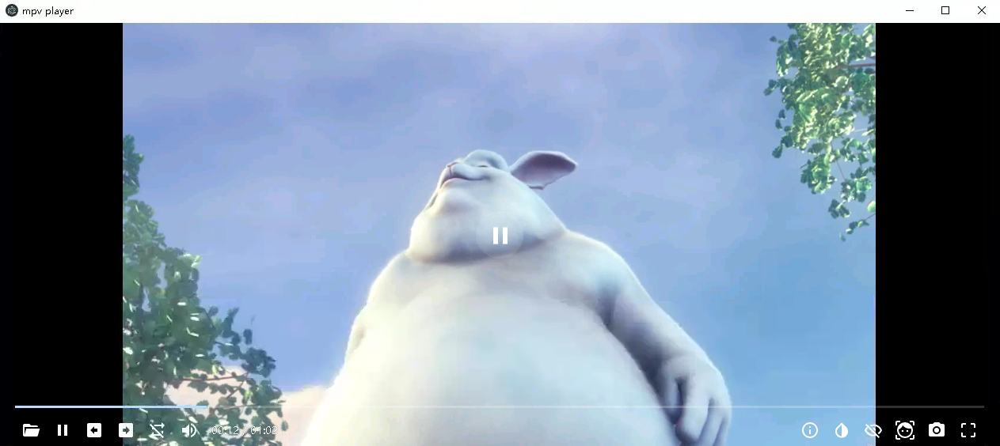
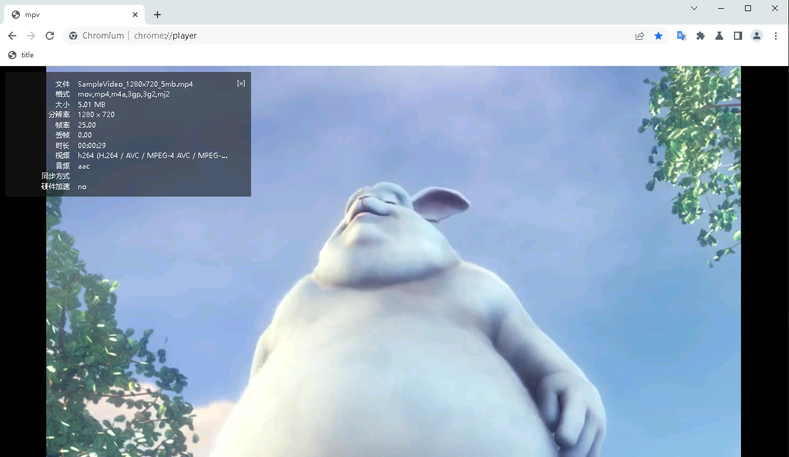

# Credits
- https://github.com/Kagami/mpv.js

The whole idea if from here.


- https://github.com/DIYgod/DPlayer

Control bar and some ui elements are from here.

# Build ppapi plugin

- download libmpv from https://sourceforge.net/projects/mpv-player-windows/files/libmpv/mpv-dev-x86_64-20221106-git-2590651

  - extract it to third_party/mpv-dev-x86_64-20221106-git-2590651

- generate mpv.lib
  - modify mpv.def, add "EXPORTS" on first line
  - lib /def:mpv.def /name:mpv-2.dll /out:mpv.lib /MACHINE:X64

- install nacl sdk
  - put sdk on root directory. C:\nacl_sdk ...


```sh
cd ppapi
mkdir build
cd build
cmake -G "Visual Studio 16" -A x64 ..
cmake --build . --config Release
```

# Register plugins in chrome (below 109)

--no-sandbox --register-pepper-plugins=mpv-win32-x64-pepper_49.dll;application/x-player

# Electron example
```
npm i
npm run start
```

# Screenshot

## in electron



## in chromium

